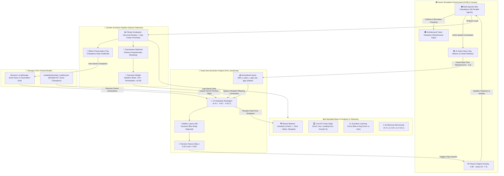

# 🐦 Flappy Bird Neural Network (Neuroevolution AI)

[](LICENSE)
[](https://developer.mozilla.org/en-US/docs/Web/JavaScript)
[-3776ab.svg)](https://www.python.org/)
[](#-how-the-ai-learns)
[](models/pretrained_models.json)
[-success.svg)](#-features)

> An interactive, 100% self-contained **Neuroevolution AI Sandbox** where artificial neural networks learn to master Flappy Bird through Darwinian natural selection in real time. Features multi-species competition, live synaptic weight inspection, sensory vision radar rays, and embedded performance analytics with zero external libraries or cloud dependencies.

---

## 🏗️ System Architecture & Workflow

The entire simulation, inference, visualization, and evolutionary engine runs locally in the client browser with optional local hosting via Python:



---

## ⚡ Core Features & Capabilities

- 🧬 **Multi-Species Darwinian Competition**:
  Three competing neural network architectures evolve simultaneously in the same environment:
  - **4-4-1 Network** (20 Olive Birds, 25 total parameters)
  - **4-8-1 Network** (20 Red Birds, 49 total parameters)
  - **4-16-1 Network** (50 Brown Birds, 97 total parameters)
- 🕸️ **Real-Time Synaptic Visualizer**:
  Live 3-panel network graph displaying dynamic connection weights:
  - 🟢 **Green Lines** = Excitatory (positive) weights
  - 🔴 **Red Lines** = Inhibitory (negative) weights
  - 🟡 **Yellow Lines** = Synapses modified by mutation in the current generation
  - **Line Thickness** = Synapse magnitude $|W|$
  - **Neuron Outer Rings** = Node bias strength and polarity (`ring = bias`)
  - **Live Output Text** = Displays real-time decision (`flap 0.50` or `wait 0.49`)
- 👁️ **AI Sensory Vision Radar (Laser Rays)**:
  Draws real-time sensory rays from the inspected bird to the upcoming obstacle:
  - Cyan dashed ray targeting the **top pipe edge**
  - Rose/Magenta dashed ray targeting the **bottom pipe edge**
  - Emerald green laser with dynamic reticle locked onto the **gap center**
- 📈 **Embedded Performance Analytics**:
  Permanently integrated on the main UI (no popups):
  - **4 Live KPI Cards**: All-time high score, current generation, dominant architecture with win rate %, and learning growth rate.
  - **Learning Progression Curve**: High-DPI canvas graph tracking max vs. average score over generations.
  - **Architecture Battle**: Real-time comparative benchmark between 4-4-1, 4-8-1, and 4-16-1 topologies.
- ◫ **Dual Adaptive Layouts**:
  Toggle seamlessly between **Bottom Dock** (panoramic game + visualizer on top, analytics dock below) and **3-Column Mode** (Game | Networks | Analytics side-by-side) with hotkey `L`.
- 💾 **Zero-Loss Auto-Persistence**:
  Automatically saves champion neural networks, high scores, and generation history to browser `localStorage` at the end of each round.
- ⚡ **Pre-Trained Champion Models Included**:
  Comes with verified, pre-trained champion models clearing **52+ pipes** out-of-the-box.
- 🔊 **8-Bit Retro Audio Synthesizer**:
  Custom Web Audio API synthesizer generating jump chirps, score chimes, crash thuds, and fanfare without external audio files.
- 🎮 **Human-vs-AI Play Mode**:
  Take control of a bird using `Space` to challenge your own evolved neural networks!

---

## 🔬 Mathematical & Algorithmic Foundations

### 1. Sensory Input Vector $\vec{X} \in [0, 1]^4$
Every frame, each bird extracts four normalized spatial values:

| Input Variable | Formula | Description |
| :--- | :--- | :--- |
| **`bird y`** | $X_0 = \mathrm{clamp}\left(\frac{y_{\mathrm{bird}}}{H_{\mathrm{canvas}}}, 0, 1\right)$ | Normalized vertical altitude of the bird |
| **`pipe x`** | $X_1 = \mathrm{clamp}\left(\frac{(x_{\mathrm{pipe}} + W_{\mathrm{pipe}}) - x_{\mathrm{bird}}}{W_{\mathrm{canvas}}}, 0, 1\right)$ | Normalized horizontal distance to next obstacle |
| **`gap top`** | $X_2 = \mathrm{clamp}\left(\frac{y_{\mathrm{top\_edge}}}{H_{\mathrm{canvas}}}, 0, 1\right)$ | Vertical coordinate of top pipe lower boundary |
| **`gap bottom`** | $X_3 = \mathrm{clamp}\left(\frac{y_{\mathrm{bottom\_edge}}}{H_{\mathrm{canvas}}}, 0, 1\right)$ | Vertical coordinate of bottom pipe upper boundary |

### 2. Forward Propagation
Activations are computed using the Sigmoid non-linearity:

$$\sigma(z) = \frac{1}{1 + e^{-z}}$$

$$\vec{h} = \sigma\left(\mathbf{W}_{\mathrm{IH}} \cdot \vec{X} + \vec{b}_{\mathrm{H}}\right)$$

$$y_{\mathrm{out}} = \sigma\left(\mathbf{W}_{\mathrm{HO}} \cdot \vec{h} + b_{\mathrm{O}}\right)$$

$$\text{Action} = \begin{cases} \mathbf{flap} \quad (v \leftarrow -7.2), & \text{if } y_{\mathrm{out}} \ge 0.50 \\ \mathbf{wait} \quad (\text{glide under gravity}), & \text{if } y_{\mathrm{out}} < 0.50 \end{cases}$$

### 3. Architecture Parameter Counts

$$\text{Total Parameters} = (N_{\mathrm{in}} \cdot N_{\mathrm{hidden}}) + N_{\mathrm{hidden}} + (N_{\mathrm{hidden}} \cdot N_{\mathrm{out}}) + N_{\mathrm{out}}$$

| Architecture | $N_{\mathrm{in}} \to N_{\mathrm{hid}}$ Weights | Hidden Biases | $N_{\mathrm{hid}} \to N_{\mathrm{out}}$ Weights | Output Bias | **Total Parameters** | Population |
| :---: | :---: | :---: | :---: | :---: | :---: | :---: |
| **4-4-1 Network** | $4 \times 4 = 16$ | $4$ | $4 \times 1 = 4$ | $1$ | **25 Parameters** | 20 Birds |
| **4-8-1 Network** | $4 \times 8 = 32$ | $8$ | $8 \times 1 = 8$ | $1$ | **49 Parameters** | 20 Birds |
| **4-16-1 Network** | $4 \times 16 = 64$ | $16$ | $16 \times 1 = 16$ | $1$ | **97 Parameters** | 50 Birds |

### 4. Fitness Function & Selection
To prevent sparse rewards and guide early evolution, fitness rewards both survival duration and vertical proximity to the gap opening:

$$F = T_{\mathrm{alive}} + (S \times 1000) + \sum_{t} \max\left(0, 1 - \frac{|y_{\mathrm{bird}} - y_{\mathrm{center}}|}{H_{\mathrm{canvas}} / 2}\right) \times 0.6$$

- **Elitism**: The #1 champion bird of each architecture is preserved unmutated to ensure no generational degradation.
- **Tournament Selection**: Pairs of candidate parents are randomly sampled from the top 25% performers; the candidate with higher fitness is cloned.
- **Gaussian Mutation**:
  $$W_{ij}' = W_{ij} + \mathcal{N}(0, \sigma^2) \quad \text{with probability } p = 0.12, \ \sigma = 0.45$$

---

## 🎮 Interactive Controls & Shortcuts

| Action | Keyboard Shortcut | Toolbar Button | Description |
| :--- | :---: | :---: | :--- |
| **Play / Pause** | <kbd>P</kbd> | `⏸ Pause` / `▶ Resume` | Freeze physics and neural inference |
| **Next Generation** | <kbd>N</kbd> | `⏭ Next Gen` | Cull alive birds and immediately breed next generation |
| **Reset Simulation** | — | `🔄 Reset` | Clear local storage and restart from Generation 1 |
| **Simulation Speed** | <kbd>1</kbd> <kbd>2</kbd> <kbd>3</kbd> <kbd>4</kbd> | `1x` `2x` `5x` `10x` | Fast-forward simulation physics for rapid training |
| **AI Vision Rays** | <kbd>V</kbd> | `👁️ Vision Rays` | Toggle sensory laser radar rays from selected birds |
| **Toggle Layout** | <kbd>L</kbd> | `◫ Layout` | Switch between **Bottom Dock** and **3-Column** view |
| **Human Play Mode** | <kbd>Space</kbd> (to flap) | `🎮 Play As Bird` | Fly alongside AI agents as a player-controlled bird |
| **Inspect Specific Bird** | Click Bird / Canvas | Click Network Panel | Select any bird on the canvas or network to view its brain |
| **Toggle Audio** | — | `🔇` / `🔊 Sound` | Toggle 8-bit retro Web Audio synthesizer |
| **Model Weights** | — | `💾 Weights` | Export, import, or load pre-trained champion JSON |

---

## 🚀 How to Run Locally

This project has **zero external package dependencies** (no `npm install`, no `pip install`). Everything runs natively in modern browsers.

### Method 1: Local Python Server (Recommended)
Serves the app and maps both `http://localhost:8000/` and `http://localhost:8000/v1-neural-network/`:
```bash
python server.py
```
*Your browser will automatically open to `http://localhost:8000/v1-neural-network/`.*

### Method 2: Standard Python HTTP Server
```bash
python -m http.server 8000
```
Navigate to: `http://localhost:8000/`

### Method 3: Direct File Execution
Double-click [`index.html`](index.html) in your file explorer to open directly in Chrome, Edge, Firefox, or Safari. All scripts, audio synthesizers, and pre-trained models work offline via `file://`.

---

## 📂 Project Structure

```
flappy-bird-neural-networking/
├── index.html                   # Main responsive dashboard UI (Split-screen & 3-Col)
├── server.py                    # Zero-dependency local Python HTTP server
├── README.md                    # Project documentation, architecture diagrams & theory
├── LICENSE                      # MIT Open-Source License
├── .gitignore                   # Python cache and temporary file ignore rules
├── css/
│   └── style.css                # Sleek dark-theme stylesheet & responsive layouts
├── js/
│   ├── neural-network.js        # Feedforward neural network & Xavier/Gaussian mutation
│   ├── bird.js                  # Agent physics, species rendering & sensory vision rays
│   ├── pipe.js                  # Obstacle tower rendering & bounding box collisions
│   ├── visualizer.js            # Live synaptic visualizer (weights, bias rings, legend)
│   ├── analytics.js             # Historical telemetry, KPI tracking & canvas charts
│   ├── audio.js                 # 8-bit retro Web Audio API synthesizer
│   ├── pretrained.js            # Bundled pre-trained models for zero-CORS offline flight
│   └── game.js                  # Game loop, multi-species populations & genetic algorithm
└── models/
    └── pretrained_models.json   # Exported champion neural networks (52+ score)
```

---

## 🏆 Pre-Trained Champion Models

The repository includes pre-trained weights in [`models/pretrained_models.json`](models/pretrained_models.json) evolved across 45 generations:

```json
{
  "version": "1.0",
  "description": "Pre-trained champion neural networks for Flappy Bird AI",
  "generation": 45,
  "maxPoints": 52,
  "speciesChampions": [
    { "architecture": "4-4-1", "score": 52, "weights": [...] },
    { "architecture": "4-8-1", "score": 52, "weights": [...] },
    { "architecture": "4-16-1", "score": 52, "weights": [...] }
  ]
}
```

To load these models at any time:
1. Click the **💾 Weights** button in the top toolbar.
2. Click **⚡ Load Pretrained Champions**.
3. Watch the birds navigate through pipes with zero crashes!

---

## 📜 License

This project is licensed under the **MIT License** — see the [LICENSE](LICENSE) file for details.

Developed with ❤️ by [Ansh Kunwar](https://github.com/anshk1234).
